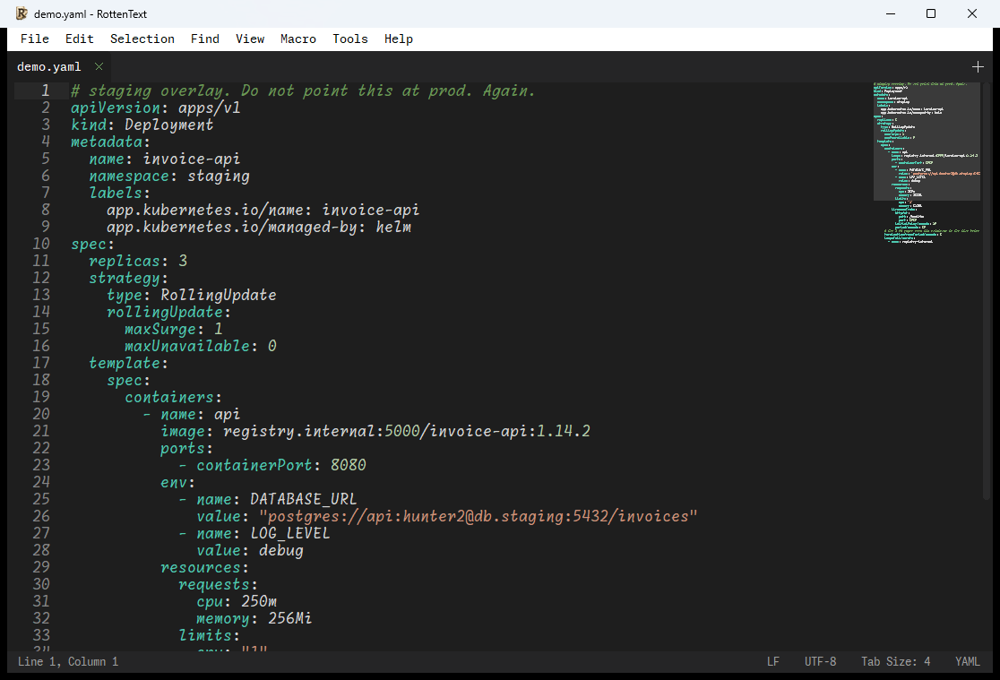

# RottenText

> A rotten editor for rotten files and rotten days.

A small, fast text editor with a sysadmin toolbox bolted to the side. Written in
Free Pascal / Lazarus. Runs on Windows, Linux and macOS. Ships as a single
binary that carries its own fonts.



## Why

If you write code for a living, there is nothing for you here. No plugin
marketplace, no AI copilot begging to autocomplete your resignation letter, no
400 MB of Electron pretending to be a text editor.

If you are a sysadmin in a hurry, stay. RottenText might save you ten seconds
now and then, several times a day.

The editor part opens files and gets out of the way. The **Tools** menu is the
reason the thing exists: it does the small, annoying, error-prone conversions
you would otherwise do by pasting company secrets into a website called
`base64-decode-online-free.ru`.

Everything runs in-process. Nothing you type leaves the machine. No telemetry,
no "anonymous usage statistics", no phone-home. The masked-entry tools never
show, insert, log or copy the secret you typed. This is not a feature, it is the
minimum bar, and the fact that it needs stating tells you everything about the
tools you were using before this one.

## The toolbox

Hashes (MD5, SHA-1, SHA-2) and HMAC, of a selection or of a whole file. Base64,
URL, HTML and hex encode/decode. Escaping for Bash, PowerShell, JSON, YAML, SQL,
sed, regex, systemd and nginx. Unix permissions both ways, and umask. Password,
UUID, token and API key generation. `.htpasswd` entries (bcrypt by default) and
LDAP `userPassword` values, plus ready-made LDIF entries.

Validate, format and sort JSON, XML, YAML, INI and TOML. Kubernetes Secrets and
ConfigMaps, encoded and decoded. `.env` files: sort, deduplicate, redact, convert
to and from JSON and YAML. Docker Compose and Podman Quadlet: list images, pull
the environment out, retag. Terraform variables and tfvars skeletons. Helm values
skeletons, and a cross-check of what a template uses against what `values.yaml`
actually defines.

IPv4 and IPv6 CIDR calculator. Timestamp converter. Cron and systemd timer
explainer, with the next runs. JWT inspector. X.509 certificate inspector,
written from scratch, no OpenSSL. Mail trace: rebuilds a message's path from its
`Received:` headers and explains the antispam verdict. Log toolkit: normalize,
sort, merge, deltas, summary. Extract and count IPs, URLs, emails, UUIDs and
hashes. Diff against a file, in a live two-pane view you can edit.


## The editor

Tabs, split view, minimap, find and replace with a live match counter, dozens of
encodings with autodetection, per-document line endings preserved on save, hex
view for binaries, syntax highlighting for 40-odd languages, 18 themes, a folder
sidebar, macros, a command palette, printing with colors, and sessions that
survive you closing the window by reflex at the end of a 14 hour shift.

No regular expressions in find-and-replace. If you want regex search across a
whole tree, you want a different tool and probably a change ticket.

## Getting it

Prebuilt packages for Windows, Linux and macOS are on the
[releases page](https://github.com/clamy54/rottentext/releases). Download,
unpack, run.

If you are the kind of sysadmin who compiles everything from source "for
security", we both know you haven't read the source, so just grab the package.

### Building from source

For the three people who insist. You need **Lazarus** (tested with 4.8) and
**FPC 3.2.2**, the `SynEdit`, `LCL` and `Printer4Lazarus` packages, and the 20
**Monaspace Frozen** TTF files in `fonts/` (they are in this repository; the
build compiles them into the binary as resources).

```sh
scripts/build.ps1          # Windows   (-Release for the small binary)
scripts/build.sh           # Linux     (--release)
scripts/make-app.sh        # macOS: builds the .app bundle, not just the binary
```

`syntax/` and `themes/` must sit next to the executable at runtime. `fonts/` does
not: the binary carries them.

Packaging scripts for the installer, the `.deb` and the `.dmg` live in
[`dist/`](dist/).

## Documentation

The manual, in [English](doc/manual.md) and in [French](doc/manuel.md). It
documents every tool, and is honest about the limits of each one, which is more
than most manuals do.

## License

GPL-2. See [`LICENSE`](LICENSE).

The binary embeds the **Monaspace** font family (SIL Open Font License 1.1) and
statically links the LCL, the Free Pascal RTL and SynEdit. Every third-party work
that ends up in a build is inventoried in
[`LICENSE_THIRD_PARTIES.md`](LICENSE_THIRD_PARTIES.md), with what a redistributor
has to do about it. If you repackage RottenText, read that file. It is short.

(c) 2026 Cyril LAMY.
